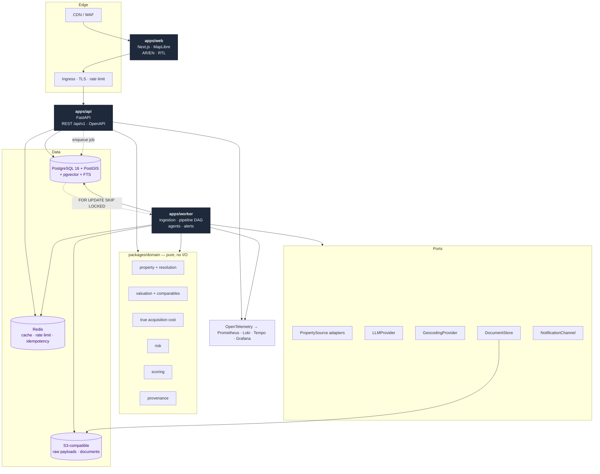
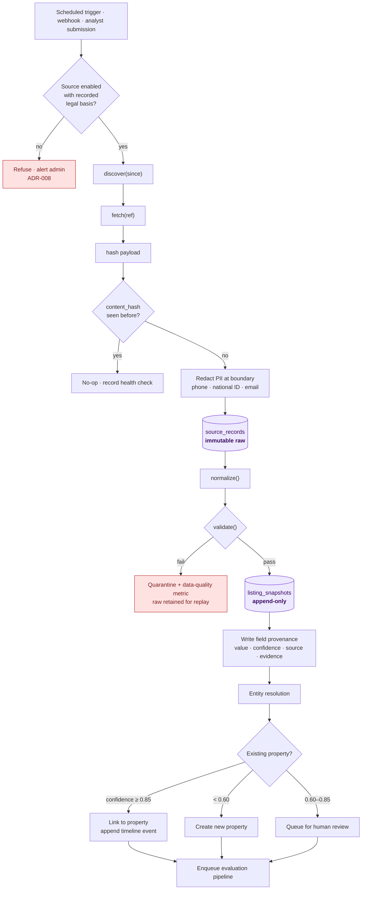
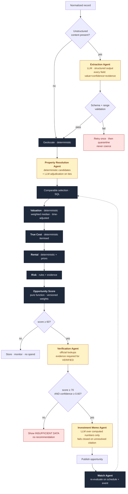
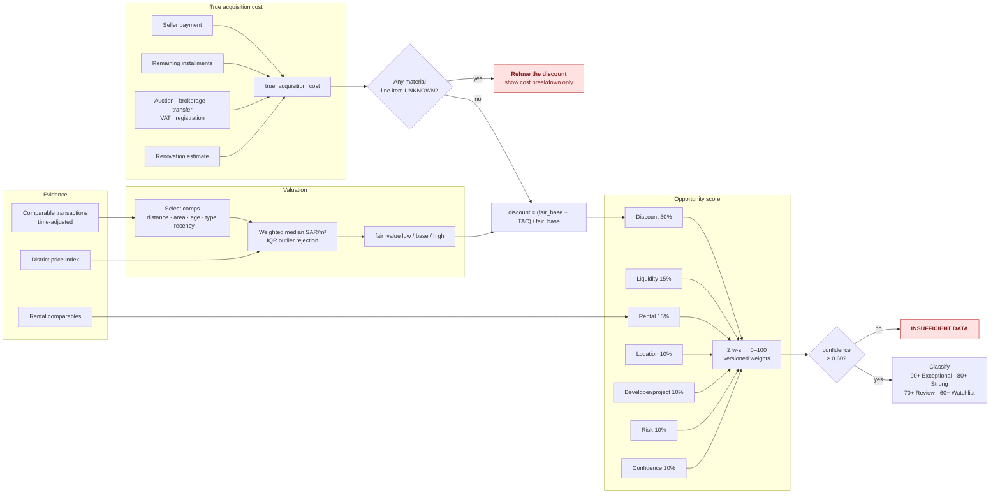
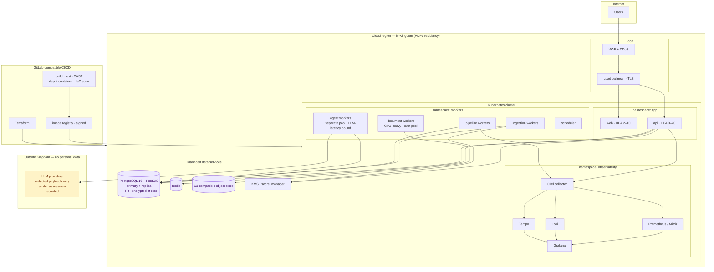

# Architecture Diagrams

All diagrams are Mermaid and render in GitHub, VitePress and the Artifacts viewer.

---

## 1. System context

Who and what the platform touches, and which trust layer each source belongs to.

```mermaid
graph TB
    subgraph Users
        INV["Individual investor"]
        OFF["Investment / family office"]
        ANL["Internal analyst"]
        ADM["Compliance / admin"]
    end

    PLAT["<b>Saudi Real Estate<br/>Opportunity Intelligence</b><br/>discover · verify · value · score · monitor"]

    subgraph Truth["Layer A — Official / Truth"]
        MOJ["MOJ open transactions<br/><i>REQUIRES VALIDATION</i>"]
        KAP["KAPSARC / GASTAT indices<br/><i>CONFIRMED</i>"]
        REGA["REGA indicators · ad licence · Wafi<br/><i>REQUIRES VALIDATION</i>"]
        INF["Infath auctions<br/><i>public web · no API</i>"]
        SPL["SPL National Address<br/><i>PARTNERSHIP</i>"]
        EJAR["Ejar aggregate index<br/><i>PARTNERSHIP</i>"]
    end

    subgraph Signal["Layer B — Opportunity Signal"]
        FIRST["First-party entry<br/>analyst · broker · user<br/><i>CONFIRMED</i>"]
        PART["Licensed feeds<br/>Wasalt · developers<br/><i>PARTNERSHIP</i>"]
        REJ["Aqar · Haraj · Bayut<br/><i>NOT RECOMMENDED</i>"]
    end

    subgraph Ext["Supporting services"]
        LLM["LLM providers<br/>PII-stripped payloads only"]
        NOTIF["Email · push · SMS"]
        IDP["OIDC identity provider"]
    end

    INV --> PLAT
    OFF --> PLAT
    ANL --> PLAT
    ADM --> PLAT

    MOJ --> PLAT
    KAP --> PLAT
    REGA --> PLAT
    INF --> PLAT
    SPL --> PLAT
    EJAR --> PLAT
    FIRST --> PLAT
    PART --> PLAT
    REJ -. "excluded by source policy<br/>ADR-008" .-> PLAT

    PLAT --> LLM
    PLAT --> NOTIF
    PLAT --> IDP

    classDef confirmed fill:#dcfce7,stroke:#15803d,color:#14532d
    classDef validate fill:#fef3c7,stroke:#b45309,color:#78350f
    classDef partner fill:#dbeafe,stroke:#1d4ed8,color:#1e3a8a
    classDef rejected fill:#fee2e2,stroke:#b91c1c,color:#7f1d1d,stroke-dasharray: 4 3
    classDef core fill:#1e293b,stroke:#0f172a,color:#f8fafc

    class KAP,FIRST confirmed
    class MOJ,REGA,INF validate
    class SPL,EJAR,PART partner
    class REJ rejected
    class PLAT core
```

---

## 2. Container architecture

Two deployables plus the web app. Modules inside the API/worker are compile-time boundaries,
not network hops.

---

## 3. Data ingestion flow

The invariant to read off this diagram: **raw bytes are stored before anything interprets them**,
and interpretation never overwrites history.

---

## 4. Agent workflow

Deterministic nodes are dark; LLM-backed agents are amber. Note how few are amber, and that
none of them touch a money field directly.

---

## 5. Opportunity evaluation flow

The money path, showing the two places the system refuses to produce a number.

---

## 6. Deployment architecture

Cloud-agnostic Kubernetes. In-Kingdom region for anything touching personal data.

