# Domain Model and Database Design

---

## 1. The idea that organises everything: provenance is a first-class type

Most property systems store `price: Decimal`. That is the mistake this product cannot afford,
because the whole value proposition is *"here is why you should believe this number."*
A bare `Decimal` has already thrown away the answer.

So the core type in `packages/domain` is:

```python
@dataclass(frozen=True)
class Provenanced[T]:
    value: T
    confidence: float          # 0.0–1.0, calibrated per extraction method
    basis: Basis               # ACTUAL | RULE | ESTIMATE | INFERRED | UNKNOWN
    source_record_id: UUID | None
    evidence: Evidence | None  # text span, document page + bbox, or API response pointer
    observed_at: datetime
```

Consequences that fall out of this one decision, for free:

- The API cannot return an unattributed price, because the serialiser has nowhere to put one.
- "Why is this 19%?" is answerable by walking references, not by reading logs.
- `basis = UNKNOWN` propagates: a `TrueAcquisitionCost` containing an `UNKNOWN` material line
  item **cannot** produce a discount. The refusal is a type-level property, not a code review item.
- Confidence aggregation is defined once and reused, rather than reinvented per feature.

## 2. Aggregates and invariants

| Aggregate | Root | Invariants enforced in the domain layer |
|---|---|---|
| **Property** | `Property` | Has ≥1 source record; coordinates or district present; `location_precision` always recorded; merging two properties preserves both timelines |
| **Listing** | `Listing` | Snapshots are append-only and monotonic in `observed_at`; the current view is derived, never stored as truth |
| **Auction** | `Auction` | Ends after it starts; a bid never decreases; an ended auction is immutable |
| **Valuation** | `Valuation` | `low ≤ base ≤ high`; ≥3 comparables or `INSUFFICIENT_COMPARABLES`; every contributing comp is persisted with its weight |
| **TrueAcquisitionCost** | `TrueAcquisitionCost` | Total equals the sum of line items exactly; each item carries a basis; presence of an `UNKNOWN` material item blocks discount computation |
| **Opportunity** | `Opportunity` | Score components sum to the total under the recorded weight version; classification derives from score **and** confidence; superseded scores are retained, never updated |
| **Verification** | `VerificationCheck` | `VERIFIED` requires a non-null evidence reference — enforced by a DB check constraint as well as the domain |

Two invariants are worth calling out because they are the ones a naive implementation breaks:

**Append-only history.** `listing_snapshots` and `opportunity_scores` have no `UPDATE` path.
A price change is a new row. This is not audit hygiene — the *sequence* is the product signal.
`950k → 920k → 875k → "urgent"` is the opportunity; a mutable `price` column destroys it.

**Score reproducibility.** `score = f(components, weight_version)` is a pure function. The
weight version is stored on the score row, so a score computed six months ago can be
recomputed and asserted identical. This is tested with golden fixtures in CI.

## 3. Entity–relationship diagram

```mermaid
erDiagram
    ORGANIZATIONS ||--o{ USERS : employs
    ORGANIZATIONS ||--o{ WATCHLISTS : owns
    ORGANIZATIONS ||--o{ SCORE_WEIGHT_PROFILES : configures
    ORGANIZATIONS ||--|| SUBSCRIPTIONS : has

    SOURCES ||--o{ SOURCE_RECORDS : produces
    SOURCE_RECORDS ||--o{ LISTINGS : yields
    SOURCE_RECORDS ||--o{ DOCUMENTS : attaches
    SOURCE_RECORDS ||--o{ DATA_PROVENANCE : substantiates

    CITIES ||--o{ DISTRICTS : contains
    DISTRICTS ||--o{ PROPERTIES : locates
    DISTRICTS ||--o{ GEO_BOUNDARIES : delimited_by
    DISTRICTS ||--o{ DISTRICT_METRICS : summarized_by

    DEVELOPERS ||--o{ PROJECTS : develops
    PROJECTS ||--o{ PROPERTY_UNITS : comprises
    PROPERTIES ||--o{ PROPERTY_UNITS : has

    PROPERTIES ||--o{ LISTINGS : advertised_as
    LISTINGS ||--o{ LISTING_SNAPSHOTS : versioned_by
    PROPERTIES ||--o{ PROPERTY_TIMELINE : records
    PROPERTIES ||--o{ AUCTION_LOTS : offered_in
    AUCTIONS ||--o{ AUCTION_LOTS : contains
    AUCTIONS ||--o{ AUCTION_EVENTS : logs
    AUCTION_LOTS ||--o{ AUCTION_BIDS : receives

    PROPERTIES ||--o{ VALUATIONS : valued_by
    VALUATIONS ||--o{ VALUATION_COMPARABLES : cites
    SALE_COMPARABLES ||--o{ VALUATION_COMPARABLES : used_as
    TRANSACTIONS ||--o{ SALE_COMPARABLES : normalized_into
    RENTAL_COMPARABLES ||--o{ RENTAL_ESTIMATES : supports
    PROPERTIES ||--o{ RENTAL_ESTIMATES : rented_at

    PROPERTIES ||--o{ OPPORTUNITIES : surfaces
    OPPORTUNITIES ||--|| TRUE_ACQUISITION_COSTS : costed_by
    TRUE_ACQUISITION_COSTS ||--o{ COST_LINE_ITEMS : itemizes
    OPPORTUNITIES ||--o{ OPPORTUNITY_SCORES : scored_by
    OPPORTUNITY_SCORES ||--o{ SCORE_COMPONENTS : decomposes
    SCORE_WEIGHT_PROFILES ||--o{ OPPORTUNITY_SCORES : parameterizes
    OPPORTUNITIES ||--o{ RISKS : flagged_by
    OPPORTUNITIES ||--o{ VERIFICATION_CHECKS : verified_by
    OPPORTUNITIES ||--o{ INVESTMENT_MEMOS : explained_by

    DOCUMENTS ||--o{ DOCUMENT_EXTRACTIONS : parsed_into

    WATCHLISTS ||--o{ WATCH_RULES : defines
    WATCH_RULES ||--o{ ALERTS : triggers
    OPPORTUNITIES ||--o{ ALERTS : subject_of
    ALERTS ||--o{ NOTIFICATIONS : delivered_as

    AGENT_RUNS ||--o{ AGENT_DECISIONS : records
    AGENT_RUNS ||--o{ LLM_CALLS : incurs
    PIPELINE_RUNS ||--o{ AGENT_RUNS : orchestrates
    PROPERTIES ||--o{ PIPELINE_RUNS : evaluated_by

    ORGANIZATIONS {
        uuid id PK
        text name
        text score_weight_profile_id FK
        timestamptz created_at
    }

    SOURCES {
        uuid id PK
        text key UK
        text source_type
        text legal_access_method "NOT NULL - CI gate"
        text data_license "NOT NULL"
        numeric source_confidence
        bool enabled
        text availability_label "CONFIRMED|VALIDATE|PARTNERSHIP|REJECTED"
    }

    SOURCE_RECORDS {
        uuid id PK
        uuid source_id FK
        text external_id
        text content_hash UK "idempotency"
        jsonb raw_payload "immutable"
        text raw_object_key "large payloads to S3"
        timestamptz retrieved_at
        text verification_status
    }

    PROPERTIES {
        uuid id PK
        text property_type
        uuid district_id FK
        uuid project_id FK
        geography location "PostGIS POINT 4326"
        text location_precision "EXACT|BUILDING|DISTRICT|CITY"
        numeric built_area_sqm
        numeric land_area_sqm
        int bedrooms
        int floor
        int build_year
        numeric resolution_confidence
        timestamptz first_seen_at
    }

    LISTING_SNAPSHOTS {
        uuid id PK
        uuid listing_id FK
        numeric asking_price
        text status
        text[] signal_tags "URGENT|ASSIGNMENT|REDUCED|AUCTION"
        timestamptz observed_at
        text content_hash
    }

    TRANSACTIONS {
        uuid id PK
        uuid source_id FK
        uuid district_id FK
        geography location
        numeric price
        numeric area_sqm
        numeric price_per_sqm "generated"
        date transacted_on
        text property_class
    }

    VALUATIONS {
        uuid id PK
        uuid property_id FK
        numeric fair_value_low
        numeric fair_value_base
        numeric fair_value_high
        int comparable_count
        numeric comparable_quality
        numeric confidence
        text method_version
        timestamptz computed_at
    }

    VALUATION_COMPARABLES {
        uuid id PK
        uuid valuation_id FK
        uuid sale_comparable_id FK
        numeric weight
        numeric time_adjusted_price_per_sqm
        jsonb weight_breakdown "per-kernel contributions"
    }

    TRUE_ACQUISITION_COSTS {
        uuid id PK
        uuid opportunity_id FK
        numeric total
        bool has_unknown_material_item "blocks discount"
        text method_version
    }

    COST_LINE_ITEMS {
        uuid id PK
        uuid cost_id FK
        text kind
        numeric amount
        text basis "ACTUAL|RULE|ESTIMATE|UNKNOWN"
        bool material
        uuid source_record_id FK
    }

    OPPORTUNITY_SCORES {
        uuid id PK
        uuid opportunity_id FK
        numeric total_score
        text classification
        numeric data_confidence
        text weight_profile_version
        text method_version
        timestamptz computed_at "append-only"
    }

    SCORE_COMPONENTS {
        uuid id PK
        uuid score_id FK
        text dimension
        numeric raw_value
        numeric normalized_score
        numeric weight
        jsonb inputs "full reproduction set"
    }

    DATA_PROVENANCE {
        uuid id PK
        text entity_table
        uuid entity_id
        text field_name
        text basis
        numeric confidence
        uuid source_record_id FK
        jsonb evidence
        timestamptz observed_at
    }

    LLM_CALLS {
        uuid id PK
        uuid agent_run_id FK
        text provider
        text model
        int input_tokens
        int output_tokens
        numeric cost_usd
        bool schema_valid
        int retry_count
    }
```



## 4. Physical design notes

**Indexes that carry the product.**

| Index | Serves |
|---|---|
| `GIST(location)` on `properties`, `transactions` | Radius, polygon and nearest-neighbour comparable search |
| `BTREE(district_id, transacted_on DESC, property_class)` on `transactions` | Comparable pre-filter, the hottest query in the system |
| `BRIN(transacted_on)` on `transactions` | Cheap on a 5M-row append-only table |
| `GIN(to_tsvector('arabic', ...))` + `pg_trgm` | Arabic/English listing search |
| `HNSW` on `pgvector` embedding | Duplicate candidate generation and NL search |
| Partial `(property_id, computed_at DESC) WHERE superseded_at IS NULL` | Current score lookup without scanning history |

**Partitioning.** `listing_snapshots`, `transactions`, `audit_events` and `llm_calls` are
range-partitioned by month from day one. Retrofitting partitioning onto a live 5M-row table is
a migration nobody enjoys; the cost now is one Alembic template.

**Row-level security.** `organization_id` RLS policies on all tenant-scoped tables, with the
session variable set by the API's request context. Belt and braces alongside application-level
scoping — a forgotten `WHERE org_id` in one repository method should not become a cross-tenant leak.

**Materialised views.** `district_metrics` (median SAR/m², transaction count, 90-day trend,
liquidity proxy) refreshed nightly `CONCURRENTLY`. Reading these instead of recomputing per
request is the difference between a 40ms and a 4s map viewport.

**Generated columns.** `price_per_sqm` is `GENERATED ALWAYS AS (price / NULLIF(area_sqm, 0))`
so it can never drift from its inputs, and `NULLIF` makes the zero-area case a `NULL` rather
than an exception at load time.
