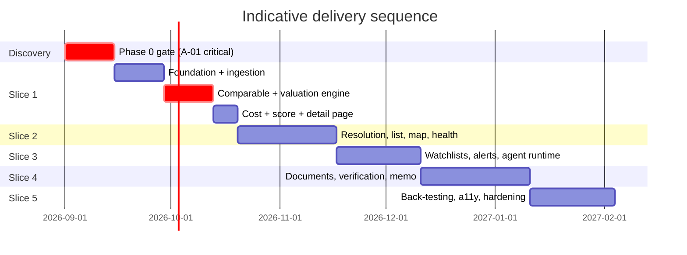

# Engineering Delivery Plan

**Principle:** build **vertical slices**, not layers. Every milestone ends with a running
application that does something a user would recognise as valuable. No milestone delivers
"the persistence layer" or "the API layer" as its outcome.

---

## Phase 0 — Discovery *(current; 1–2 weeks, no production code)*

Deliverables: this document set. Exit gate below.

**Phase 0 exit gate — all must be true before Phase 1 starts:**

1. **A-01 validated** (E0.1): transaction-level MOJ data confirmed obtainable, with schema and
   licence documented — **or** a commercial fallback contracted.
2. Counsel opinion on the KSA Open Data License for commercial derivative use (E0.2).
3. Counsel opinion on regulated-advertiser status (E0.3).
4. PDPL assessment complete, including cross-border inference; residency decision made (E0.7).
5. Comparable-density study shows ≥8 usable comps for a median apartment in ≥3 of the 4 target
   districts (E0.4).
6. This architecture reviewed and internally consistent.

If (1) or (5) fails, **stop and re-scope.** Building a valuation engine without comparable
density produces confident nonsense, which is worse than no product.

---

## Vertical slices

Each slice is independently testable and independently demonstrable.

### Slice 1 — "One opportunity, end to end" *(the brief's recommended first slice)*

**Goal:** an analyst enters one real Infath lot; the system values it, costs it, scores it, and
shows it on a page with its comparables.

Path: analyst entry → normalised property → PostGIS → comparable lookup → valuation → true
cost → opportunity score → API → opportunity detail page.

| Includes | Excludes |
|---|---|
| E1.1–E1.6, E2.1, E2.2, E2.4, E2.5, E2.6, E2.7, E3.1, E3.2, E4.1–E4.5, E5.1, E5.4, E6.2 (subset), E6.6 | Agents, alerts, map, entity resolution, memo |

**Done when:** a real Riyadh property is entered by hand and the page shows a fair-value band,
its actual comparables, an itemised true cost, and a reproducible score — and **an analyst
agrees with the number.** That last clause is the acceptance criterion that matters; everything
else is plumbing.

**Why this slice first:** it exercises the riskiest thing in the product (does the valuation
work on real Saudi data?) with the least infrastructure. If comparable density is inadequate,
we discover it in week 3 rather than month 4.

*Estimated: 4–5 weeks.*

### Slice 2 — "Many opportunities, ranked and mapped"

E2.9, E3.3 (entity resolution), E3.5 (timeline), E5.3 (risk), E5.5 (confidence gate),
E6.1 (list), E6.3 (map), E8.1 (source health), E1.7 (AR/EN + RTL).

**Done when:** 50+ Riyadh opportunities are ranked, deduplicated across sources, browsable on a
map, with `INSUFFICIENT DATA` correctly suppressing weak-evidence recommendations.

*Estimated: 4 weeks.*

### Slice 3 — "Tell me, don't make me look"

E6.4 (watchlists), E6.5 (alerts), E4.6 (rental & yield), E7.1/E7.2 (agent runtime + provider
abstraction), E8.3 (cost dashboard).

**Done when:** the acceptance scenario (backlog §Acceptance) fires an accurate alert within
5 minutes, and the cost dashboard shows per-opportunity spend inside budget.

*Estimated: 3–4 weeks.*

### Slice 4 — "Read the documents, explain the decision"

E7.3 (extraction), E7.4 (injection defences), E7.5 (document intelligence), E7.6 (verification),
E7.7 (memo), E7.8 (NL search).

**Done when:** an auction PDF is ingested and its extracted fields carry page-level citations;
the memo is generated and every figure traces to a computed field; the injection corpus suite passes.

*Estimated: 4–5 weeks.*

### Slice 5 — "Trustworthy at scale"

E4.7 (back-testing), E6.7 (accessibility), E8.2, E8.4, E8.5, E8.6, E5.6 (weight profiles),
E7.9 (watch agent materiality).

**Done when:** back-testing meets the targets in the valuation spec §7, restore has been
rehearsed and timed, pen-test findings are triaged, and WCAG 2.1 AA is verified in both locales.

*Estimated: 3–4 weeks.*

**Indicative total to MVP: 18–22 weeks** for a team of 3–4 engineers plus a part-time analyst,
assuming the Phase 0 gate passes cleanly.

---

## Milestone discipline

After **every** milestone, without exception:

```
pnpm/make format      # auto-fix and format
make lint             # ESLint + ruff
make typecheck        # tsc + mypy strict
make test             # unit + integration (testcontainers)
make migrate:check    # up and down, verified
make up               # application starts clean
```

Failures are fixed before continuing. A milestone that leaves the application non-runnable is
not complete, regardless of how much code it added. Each milestone also updates a short
CHANGELOG entry describing what changed and why.

---

## Definition of Done

A **story** is done when:

- [ ] Acceptance criteria met and demonstrated on real (not synthetic) Riyadh data where applicable
- [ ] Unit tests for domain logic; integration tests for I/O paths; contract tests where an API shape changed
- [ ] Type checking passes in strict mode; no new `Any` on a module boundary
- [ ] Migrations included, reversible, and verified up **and** down
- [ ] **Provenance recorded** for any new externally-derived field
- [ ] **Any new money field is deterministic and unit-tested** — no LLM in the calculation path
- [ ] Observability: relevant metric and span emitted
- [ ] Security: input validated, output encoded, authorisation enforced, no secret or PII logged
- [ ] Accessibility: keyboard reachable, labelled, not colour-only, RTL correct
- [ ] Arabic and English strings present; no hard-coded user-facing text
- [ ] Documentation updated — including the data source matrix if a source changed
- [ ] Reviewed by someone who did not write it

A **slice** is done when all of the above hold, plus:

- [ ] The end-to-end path is demonstrated to a stakeholder on real data
- [ ] Performance targets in PRD §6 met for the paths it introduced
- [ ] Cost per opportunity measured and inside budget
- [ ] Rollback plan exists and has been tested for any risky migration

**The credibility invariant, checked at every slice:** no opportunity is displayed with a
classification stronger than its evidence supports. This is verified by a test suite, not by
inspection — and a violation blocks release regardless of what else is ready.

---

## Team shape

| Role | Allocation | Focus |
|---|---|---|
| Backend / data engineer | 1.5 | Ingestion, comparable engine, valuation |
| Full-stack engineer | 1 | API, web, map |
| AI / platform engineer | 0.5–1 | Agent runtime, extraction, memo |
| Real-estate analyst | 0.5 | Source entry, ground-truth review, back-testing |
| Product / architecture | 0.5 | This role; partnerships and legal follow-through |

The analyst is not optional. **A valuation engine with no domain expert reviewing its output is
an unvalidated model**, and the blind-review acceptance criterion cannot be met without one.

---

## Sequencing dependencies worth watching



Two dependencies dominate everything else and should be tracked weekly:

1. **E0.1 → E2.5 → E4.1.** No transaction data, no comparables, no product. Everything
   downstream of the valuation engine is blocked on a fact we have not yet verified.
2. **Partnership lead times (E0.5/E0.6) are measured in months, not sprints.** Start them in
   week 1 even though nothing depends on them until Slice 3, because a signed Wasalt or Infath
   agreement arriving in month 6 is a step change in product value — and one that arrives in
   month 12 is a missed year.
